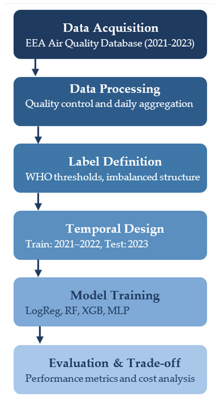
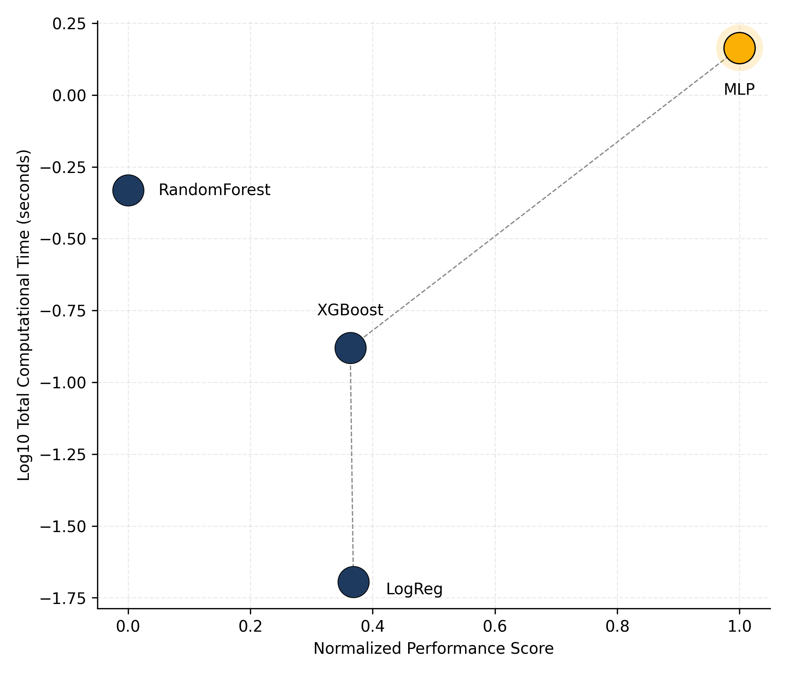

[](https://creativecommons.org/licenses/by/4.0/)
[](https://quarto.org/)
[](https://github.com/jcaceres-academic/urban-pm25-imbalance-evaluation)
[](https://doi.org/10.5281/zenodo.18734761) 

---


## 🔗 **Direct access**
- 🧪 [Methodological scripts and pipeline implementation](scripts.html)
- 💻 [Reproducible notebook](notebook.html)
- 📄 [Associated article]()


## 🧠 Overview

This repository hosts the open, reproducible materials supporting a methodological study on urban PM2.5 classification under structural imbalance and deployment constraints.

Rather than introducing a new predictive model, the project proposes a coherent evaluation framework designed for real-world environmental monitoring contexts, where:

- Rare high-pollution episodes are critical
- Temporal structure must be preserved
- Computational feasibility matters

The case study focuses on Lisbon (2021–2023), using official data from the European Environment Agency (EEA).


## 🎯 Research motivation

Model comparison in environmental machine learning often relies on:

- Random train–test splits that ignore temporal structure,
- Accuracy-driven benchmarking,
- Limited consideration of rare-event detection,
- Neglect of computational cost in operational contexts.

These practices can distort the interpretation of model performance when applied to real urban monitoring systems.

This project responds by integrating:

- Time-aware validation (Train: 2021–2022 | Test: 2023),
- Imbalance-sensitive metrics (Balanced Accuracy, Macro-F1),
- Explicit computational cost analysis (training + inference),
- A multi-criteria performance–cost comparison.

The emphasis is methodological coherence rather than algorithmic novelty.

## 🧩 Reproducible methodological workflow

The analytical workflow follows a structured and sequential pipeline:

{fig-align="center" width="60%"}

**Fig. 1.** Structured evaluation pipeline integrating data acquisition, daily aggregation, WHO-based label definition, temporal validation (2021–2022 / 2023), model training, and performance–cost assessment.

1. **Data acquisition and harmonisation**
   Aggregation of hourly PM2.5 observations into daily values and classification under WHO thresholds.

2. **Imbalance analysis**
   Examination of class distribution and structural asymmetry in rare high-pollution events.

3. **Model training under temporal validation**
   Logistic Regression, Random Forest, XGBoost, and MLP trained on 2021–2022 data.

4. **Imbalance-aware evaluation**
   Balanced Accuracy, Macro-F1, and class-specific recall for the High category.

5. **Performance–Cost trade-off assessment**
   Integration of computational cost as a formal evaluation dimension.

This workflow reflects a deployment-oriented evaluation stance, not a technology-driven benchmark.


## 🧭 Analytical philosophy

The framework is guided by the following principles:
- Chronological integrity: no random splits are applied to temporal data.
- Imbalance awareness: rare-event detection is prioritised over aggregate accuracy.
- Operational realism: computational cost is treated as an evaluation criterion.
- Reproducibility by design: all results are generated programmatically.
- Comparative transparency: model trade-offs are explicitly visualised.

This perspective aligns with the broader doctoral research programme in applied data science and sustainable urban analytics.

## 📊 Performance–Cost trade-off

Model comparison integrates predictive performance with computational cost, treating efficiency as a formal evaluation dimension.

{fig-align="center" width="75%"}

**Fig. 2.** Performance–Cost trade-off across models (Lisbon, 2021–2023). The plot illustrates the efficiency frontier under imbalance-sensitive evaluation criteria.

## 🗂️ Repository structure

```text
urban-pm25-imbalance-evaluation/
   ├── docs/                      # Rendered Quarto website (GitHub Pages)
   │   ├── index.html
   │   └── notebook.html
   ├── data/                      # Consolidated parquet datasets
   ├── figures/                   # High-resolution publication figures
   ├── images/                    # Web-optimised PNG assets
   ├── scripts/                   # Python scripts implementing the evaluation pipeline
   ├── index.qmd
   ├── notebook.qmd
   ├── _quarto.yml
   ├── LICENSE
   └── README.md
```

## ⚙️ Technologies Used

| Category | Tools / Packages |
|----------|------------------|
| **Programming** | [Python](https://www.python.org/) 3.11 + · [Quarto](https://quarto.org/) |
| **Data Handling** | `pandas` · `pyarrow` · `numpy` |
| **Visualisation** | `matplotlib` · `seaborn` |
| **Modelling** | `scikit-learn` · `xgboost` |
| **Evaluation** | `Balanced Accuracy` · `Macro-F1` · `Precision/Recall` |
| **Reproducibility** | `Git` · `GitHub Pages` · `Conda` · `Zenodo` |


```
{fig-align="center" width="90%"}
```
**Fig. 1.** Performance–Cost trade-off across models, illustrating the efficient frontier under imbalance-sensitive evaluation (Lisbon, 2021–2023).


## 🎓 Relation to the doctoral thesis

This project constitutes a methodological extension of ongoing doctoral research in applied data science. 
It complements prior work on urban PM2.5 modelling by shifting the focus from predictive benchmarking to evaluation coherence under structural constraints.
The repository illustrates how a research line evolves toward more operationally grounded analytical frameworks.


## 📚 Citation (Article)

If you reuse or adapt this resource, please cite as:

> Shu, Z., Cáceres-Tello, J., Galán-Hernández, J. J., Rua, O. L., & Carrasco, R. A. (2026).  
Rethinking Model Evaluation for Urban PM2.5 Classification: Imbalance, Temporal Validation and Computational Cost.  
(Under submission).

## 📦 Dataset Citation

The bibliographic reference dataset associated with this project is available at:

> Cáceres-Tello, J. (2026).  
Bibliographic dataset for urban PM2.5 imbalance evaluation study.  
Zenodo. https://doi.org/10.5281/zenodo.18734761

## ⚖️ License

Code and notebooks: Creative Commons Attribution 4.0 (CC BY 4.0)
Data (if reused): CC0 1.0 Public Domain Dedication


## 📬 Contact

Jesús Cáceres-Tello
Department of Computer Systems and Computing
Universidad Complutense de Madrid

📧 [jcaceres.academic@gmail.com](mailto:jcaceres.academic@gmail.com)  
📧 [jescacer@ucm.es](mailto:jescacer@ucm.es)

⬅️ [Back to my main page](https://jcaceres-academic.github.io)

This repository supports open, transparent, and reproducible research in environmental data science and STEM education.
