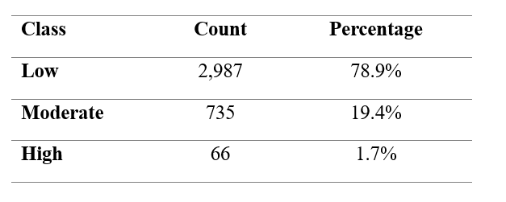
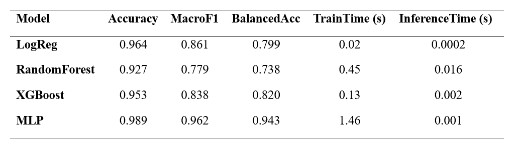
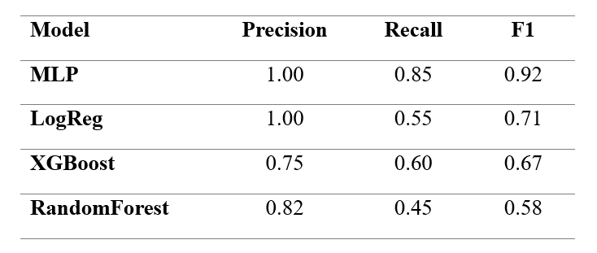
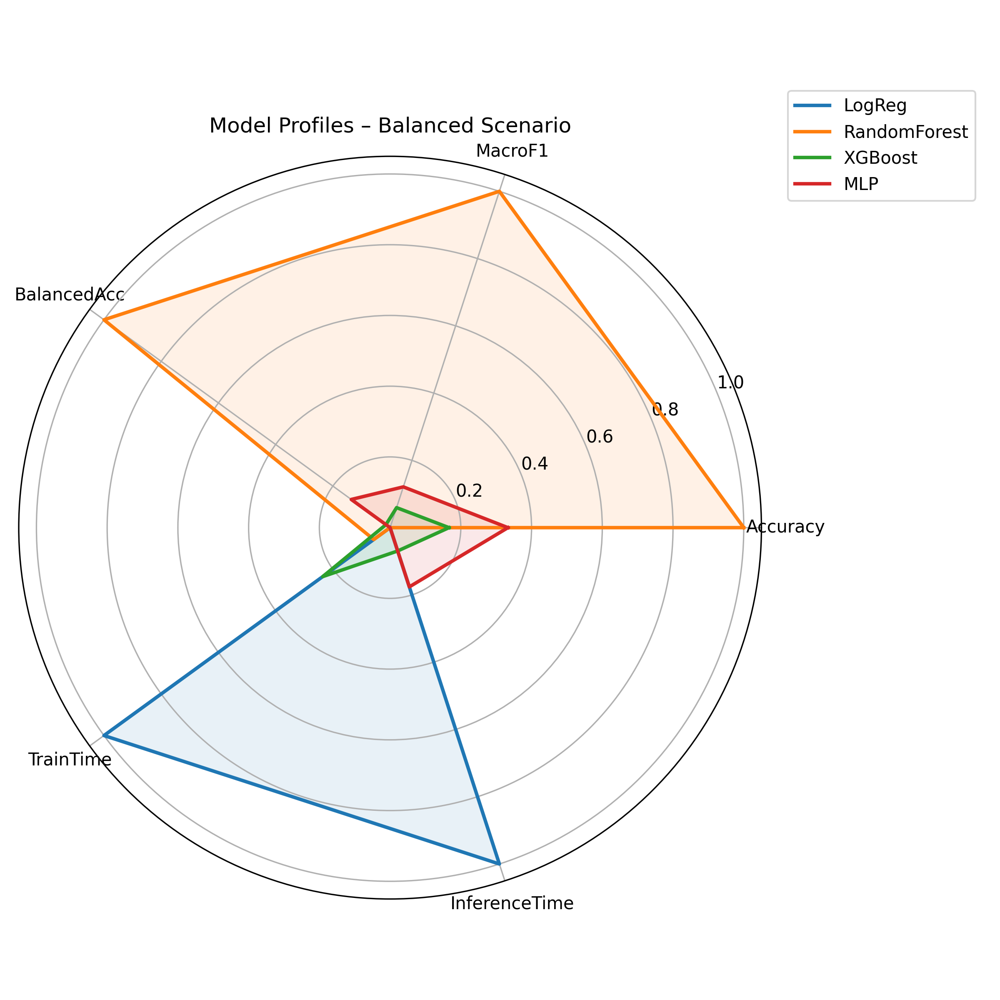
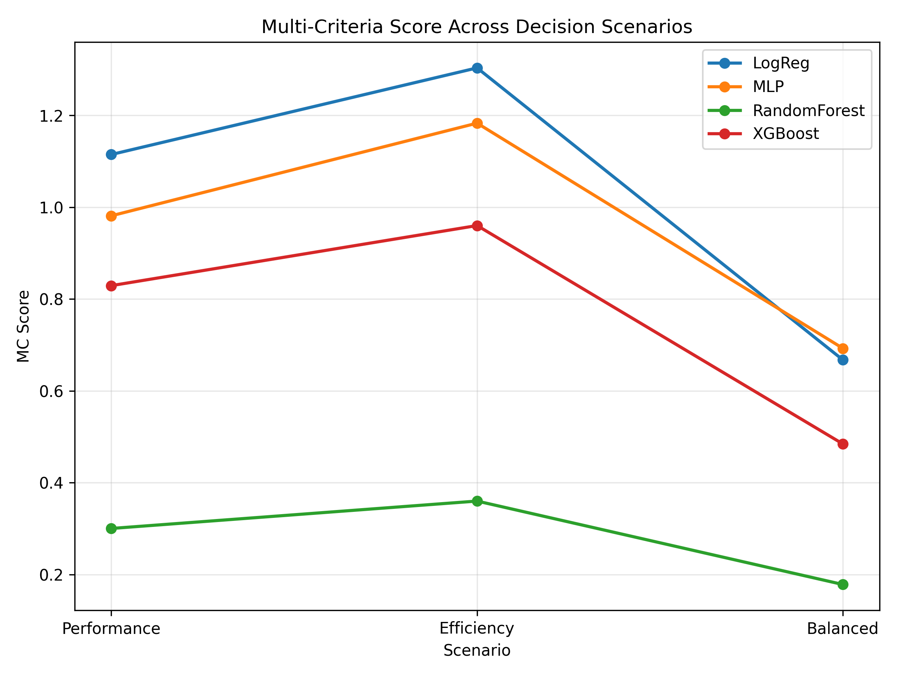

# 📂 Data acquisition and processing

## Analytical context

The evaluation framework begins with the acquisition and harmonisation of daily PM2.5 observations obtained from the European Environment Agency (EEA) for Lisbon (2021–2023).

The objective of this stage is to ensure chronological integrity, consistency of measurements, and transparent preprocessing before any modelling procedure.

{fig-align="center" width="60%"}

**Fig. 1.** Structured evaluation pipeline integrating data acquisition, daily aggregation, WHO-based label definition, temporal validation (2021–2022 / 2023), model training, and performance–cost assessment.

## Class distribution and imbalance structure

Daily PM2.5 concentrations are categorised into Low, Moderate, and High classes according to WHO-based thresholds. The resulting distribution is structurally asymmetric.

{fig-align="center" width="70%"}

**Table 1.** Distribution of daily PM2.5 classes under WHO-based thresholds.

High-pollution days represent a small fraction of total observations. This imbalance implies that aggregate accuracy may mask poor detection of rare but critical events. Consequently, the evaluation framework explicitly accounts for class asymmetry.

# 🔍 Structural and temporal considerations

Environmental time series exhibit strong chronological dependence. Random train–test splits may introduce information leakage and produce overly optimistic performance estimates.

To preserve realistic deployment conditions, a strict temporal partition is applied:

- Training period: 2021–2022
- Testing period: 2023

This design ensures that model evaluation reflects prospective rather than retrospective performance.

# 📐 Imbalance-aware modelling and evaluation

The objective of this modelling stage is not to propose a novel algorithm, but to compare representative classifiers under consistent temporal and imbalance-aware conditions.

Performance is assessed using both aggregate and class-sensitive metrics.

{fig-align="center" width="80%"}

**Table 2.**. Global performance metrics and computational cost per model.

Accuracy is reported for completeness but not prioritised. Balanced Accuracy and Macro-F1 provide a more reliable summary under structural imbalance.

Given the public health relevance of high-pollution episodes, specific attention is given to class-level metrics for the High category.

{fig-align="center" width="70%"}

**Table 3**. Precision, Recall, and F1-score for the High pollution class.

These results demonstrate that models with comparable global metrics may differ substantially in rare-event detection capacity.

# 📊 Multi-criteria comparison across scenarios
Analytical context

Model comparison depends on the evaluation priorities adopted. Three decision scenarios are considered:
- Performance-driven
- Efficiency-driven
- Balanced

{fig-align="center" width="70%"}

**Fig. 2**. Radar comparison of models under the balanced scenario.

{fig-align="center" width="70%"}

**Fig. 3**. Model rankings across alternative evaluation scenarios.

The variation in rankings highlights the importance of explicitly defining evaluation criteria rather than relying on single-metric optimisation.

# ⚖️ Performance–Cost trade-off assessment

Operational deployment requires integrating predictive performance with computational feasibility. Training and inference time are therefore incorporated as formal evaluation dimensions.

{fig-align="center" width="70%"}

**Fig. 4**. Performance–Cost trade-off map illustrating the efficiency frontier under imbalance-sensitive evaluation.

Models located on the efficiency frontier represent optimal compromises between predictive quality and computational cost.

# 🧭 Methodological implications

This educational walkthrough leads to several key conclusions:

1. Structural class imbalance distorts naive accuracy-based evaluation.
2. Temporal validation is essential in environmental monitoring contexts.
3. Rare-event recall is a critical performance dimension.
4. Computational cost meaningfully alters model selection decisions.
5. Evaluation coherence outweighs algorithmic novelty.

# 🧠 Interpretation of results

## Analytical synthesis

The evaluation results demonstrate that model comparison under structural imbalance cannot rely on a single aggregate metric.

Several key patterns emerge:

- Models with similar Accuracy may differ substantially in Balanced Accuracy.
- Rare-event recall varies significantly across algorithms.
- Computational cost meaningfully alters the ranking of models.
- The efficient frontier identifies models that achieve optimal performance–cost compromises.

These findings reinforce the central argument of the study: evaluation coherence is more important than algorithmic complexity.

## Educational implications

From a methodological perspective, this case study illustrates that:

- Temporal integrity must be preserved in environmental datasets.
- Rare-event detection requires explicit metric selection.
- Deployment constraints should be integrated into evaluation frameworks.
- Multi-criteria comparison prevents misleading single-metric optimisation.

The framework therefore serves as both an analytical tool and a teaching resource.

# 🌐 Repository and Citation

All datasets, scripts, and visualisations used in this study are openly available at:
➡️  https://github.com/jcaceres-academic/urban-pm25-imbalance-evaluation

The bibliographic dataset associated with this project is archived in Zenodo:
➡️ https://doi.org/10.5281/zenodo.18734761

When citing the associated research article, please use:

> Shu, Z., Cáceres-Tello, J., Galán-Hernández, J. J., Rua, O. L., & Carrasco, R. A. (2026).
Rethinking Model Evaluation for Urban PM2.5 Classification: Imbalance, Temporal Validation and Computational Cost.

Manuscript submitted for publication. Open research materials available at:
https://github.com/jcaceres-academic/urban-pm25-imbalance-evaluation